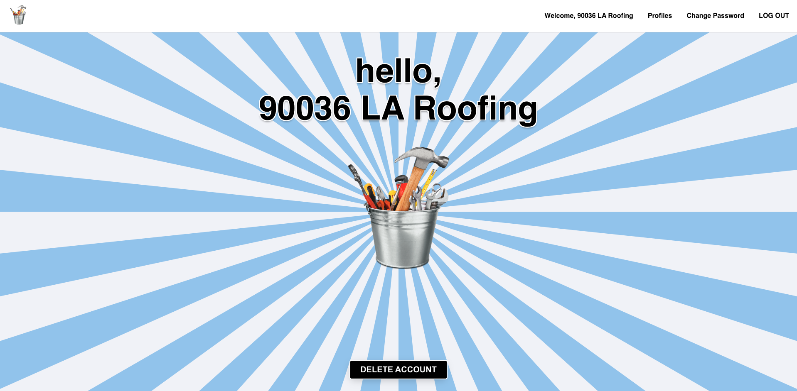

# VENDO.MTR 
## [Click here to launch the app.](https://vendo-mtr.netlify.app/) 

#### VENDO.MTR was created for trade professionals to rate and recommend each other; ideally, the ultimate purpose and functionality of the app will be to rate professionals and their services (RE Yelp). This is a decoupled PERN stack application with JWT token-based authentication. Users can create, rate (edit), and delete an account.

[Click here to visit VENDO.MTR back-end repo.](https://github.com/dimisavva/vendor-meter-back-end.git)

## Technologies used
* React App with the Vite tool
* TypeScript
* Express
* Node.js
* AJAX
* JWT token-based authentication
* PostgreSQL with Bit.io
* Netlify for front-end deployment
* Fly.io for back-end deployment

## Ice Box
- [ ] Consumer Login.
- [ ] Write comments on Vendors' profiles.
- [ ] AAO, respond to comments.
- [ ] Responsive design.

## Credits
* All GA Instructors, TAs, and classmates for their help.
* <a href="https://www.canva.com/photos/MAEXNOY7yg8-tool-/" title="">Bucket icon created by Canva Creative Studio.</a>
